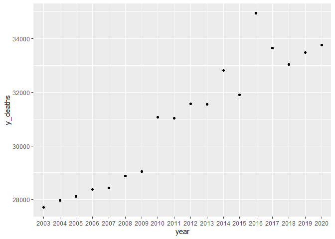
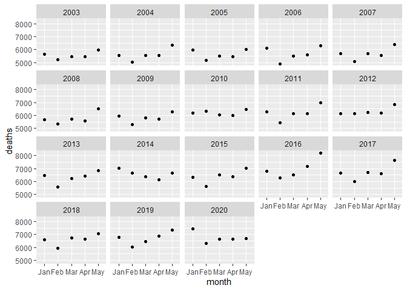
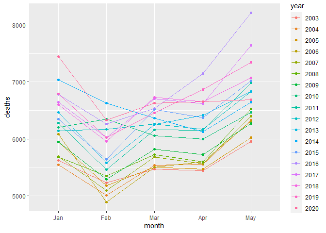
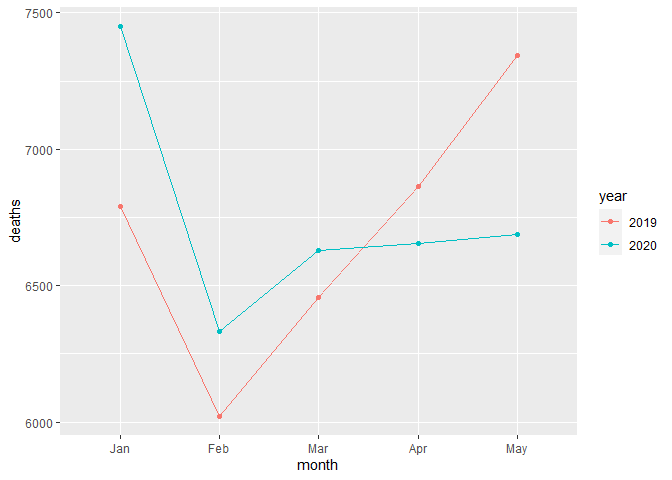
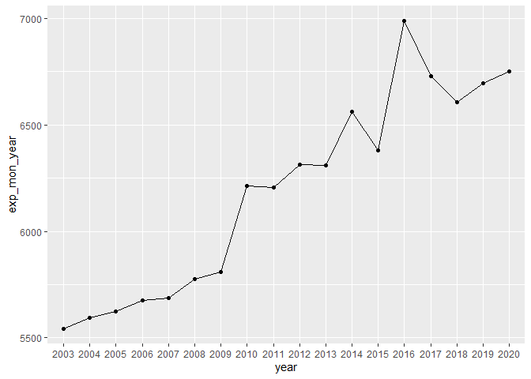
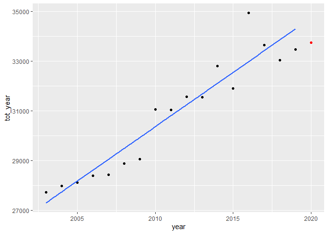
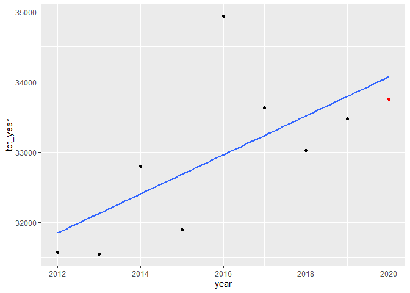

Dados do RS de 20013 a 2018 obtidos em https://sidra.ibge.gov.br/tabela/2681

Dados de 2019 e 2020 obtidos em https://transparencia.registrocivil.org.br/registros


## Introdução 

Neste artigo, tenterei estimar o tamanho da subnotificação de casos de coronavirus no estado Brasileiro do Rio Grande do Sul. Farei uma comparação em três modos: (1) comparar as mortes mensais de 2020 com as mortes mensais de 2019, (2) comparar as mortes mensais de 2020 com uma previsão de mortes mensais para 2020 com base em uma tendencia simples de mortes mensais feita com base em dados dos ultimos 17 anos, (3) comparar as mortes de 2020 com a media das mortes dos oito anos anteriores.

Antes de começar minha analise, é importante notar que essas comparações podem ser enviasadas de uma maneira. Já que o coronavirus está lotando a capacidade médica do estado (citação), pode ser que númeras pessoas morram por falta de capacidade hospitalar mesmo que não fossem afetadas pelo SARS-CoV-2. É difícil estimar a magnitude desse viés. Mesmo assim, minha analise pode prover estimativas do real número de mortes causadas pelo coronavirus dadas estimativas para a quantidade de mortes causadas por tais limites hospitalares e não por Covid-19. 

## Análise 
Observe as mortes anuais de 2003 até 2019.
<!-- -->

Também podemos ver o numero de mortes de cada mês desde 2003 até 2020.
<!-- -->

No gráfico abaixo, vemos as mortes por mês por ano em um só plano. 
<!-- -->


### 2019 e 2020
No gráfico abaixo, observe as mortes mensais de 2019 e as mortes mensais de 2020 no estado do Rio Grande do Sul. 
<!-- -->

Essa comparação da a entender que Covid-19 não tem matadado muitos, visto que o número total de mortes de maio de 2020 é menor que de maio de 2019. Mas só podemos tomar essa conclusção após comparar os números de 2020 com os números esperados de 2020 - não somente com os números de 2019. Um ano só pode sofrer variabilidade imensa, então não podemos usar só 2019 como nosso número esperado de mortes
Nesta tabela, podemos observar a diferença entre cada mês.

```
## # A tibble: 5 x 3
##   month `2019` `2020`
##   <fct>  <dbl>  <dbl>
## 1 Jan     6789   7449
## 2 Feb     6022   6331
## 3 Mar     6458   6629
## 4 Apr     6865   6655
## 5 May     7342   6687
```

### Projeção de 2003 a 2019

```
## `summarise()` ungrouping output (override with `.groups` argument)
```

```
## # A tibble: 18 x 2
##    year  exp_mon_year
##    <fct>        <dbl>
##  1 2003         5544 
##  2 2004         5593.
##  3 2005         5624 
##  4 2006         5677.
##  5 2007         5685.
##  6 2008         5776.
##  7 2009         5810.
##  8 2010         6211.
##  9 2011         6207 
## 10 2012         6315.
## 11 2013         6310 
## 12 2014         6560 
## 13 2015         6379.
## 14 2016         6987 
## 15 2017         6727.
## 16 2018         6605.
## 17 2019         6695.
## 18 2020         6750.
```

<!-- -->

# Ano-a-ano
Vamos agora comparar as mortes de 2020 com duas estimativas: a média dos anos de 2003 à 2019, e o valor esperado para 2020 a partir de uma regressão linear.

## Media de mortes por mes dos anos de 2003 a 2019 (usando somente meses de janeiro a maio).

```
## # A tibble: 1 x 1
##   exp_dea2020
##         <dbl>
## 1       6159.
```
Compare esse número com o número total de mortes em 2020 até o fim de Maio, que é 6750.2. A diferênça é de aproximadamente 591 mortes. 

No entanto, note que há claramente uma tendencia no número de mortes por ano. Ao invéz de vermos variabilidade randômica nos anos, vemos que a cada ano, o número de mortes tende a crescer. Isso provavelmente é devido a uma combinação de fatores, entre eles o continuo aumento da população do estado do Rio Grande do Sul de ano em ano. 

Por isso, agora vamos utilizar um método de comparação que leva em consideração esse aumento esperado de mortes.

## Regressão linear do número total de mortes por ano
Vamos fazer uma regressão linear, que basicamente encontrará a reta que melhor representa a progressão de mortes no RS dos anos de 2003 à 2019.

```
## `summarise()` ungrouping output (override with `.groups` argument)
```

Agora, criamos o modelo linear.

```
## 
## Call:
## lm(formula = tot_year ~ year, data = RS_years)
## 
## Coefficients:
## (Intercept)         year  
##   -849051.1        437.5
```

```
## `geom_smooth()` using formula 'y ~ x'
```

<!-- -->

Com isso podemos concluir o seguinte relacionamento:
mortes(ano)=-849051.1  + 437.5(ano)

Portanto, podemos esperar que em 2020, o numero total de mortes no RS de Janeiro até Maio seja de -849051.1  + 437.5(2020) = 34698.9

Compare esse número com o total de mortes real de 2020 até Maio, que é 33751. A diferença é de aproximadamente 947 mortes. Ou seja, em 2020 tivemos quase mil mortes a menos que o numero esperado de acordo com uma regressão linear simples. Observe no gráfico o ponto vermelho indicando o ano de 2020. 

Isso tende a confirmar que não houve uma subnotificação significativa no RS. Mas antes de deixar essa conclusção tentativa, vamos fazer um último teste. A mesma regressão mas usando menos dos anos antigos. Então vamos de 2012 até 2019 dessa vez.


```
## `summarise()` ungrouping output (override with `.groups` argument)
```

```
## 
## Call:
## lm(formula = tot_year ~ year, data = RS_newyears)
## 
## Coefficients:
## (Intercept)         year  
##     -527487          278
```

```
## `geom_smooth()` using formula 'y ~ x'
```

<!-- -->

Observe que nossa nova equação seria: mortes(ano)=-527487 + 278(ano).
Ou seja, esperariamos um número total de mortes ate Maio em 2020 de 34073. Isso é um pouco menor que a nossa estimativa anterior. Mas ainda assim, resulta que 2020 teve 322 mortes a menos que o esperado. 
